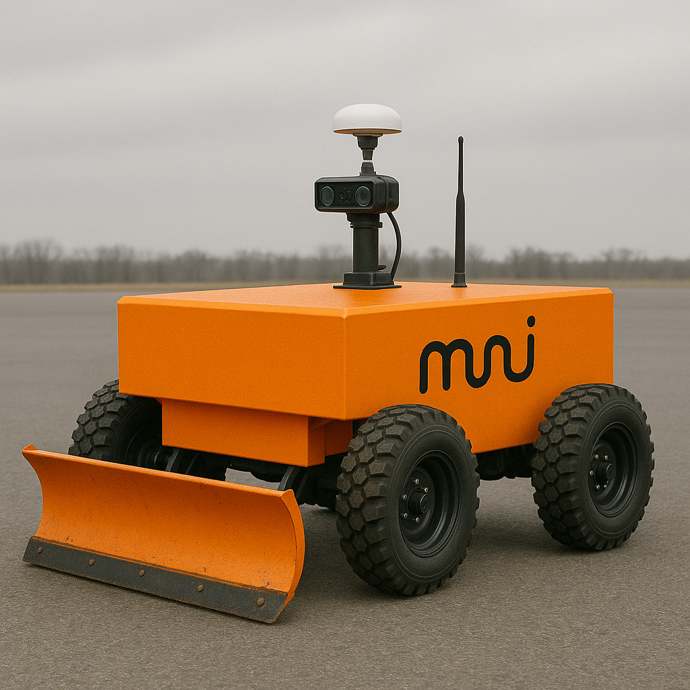

<picture>
  <source media="(prefers-color-scheme: dark)" srcset="web/public/images/muni-logo-dark.svg">
  <source media="(prefers-color-scheme: light)" srcset="web/public/images/muni-logo-light.svg">
  
</picture>

Open-source municipal robotics. Autonomous utility vehicles for public works, starting with sidewalk snow removal.



## Repository

```
muni/
├── bvr/              # Base Vectoring Rover (first morphology)
│   ├── firmware/     # Onboard software (Jetson Orin NX, Rust)
│   ├── cad/          # Mechanical design
│   ├── electrical/   # Schematics, PCBs
│   └── docs/         # BVR-specific documentation
├── depot/            # Base station (fleet ops, teleop, metrics)
├── mcu/              # Embedded firmware (RP2350, ESP32-S3)
├── paper/            # Technical documents (Typst)
└── web/              # Website
```

## Architecture

```
┌─────────────────────────────────────────────────────────────────────────────┐
│ Depot (Base Station)                                                        │
│                                                                             │
│   Console (:80)     Grafana (:3000)     InfluxDB        SFTP (:2222)       │
│   Fleet ops         Dashboards          Metrics DB      Session storage    │
│   Teleop UI         Alerts              Time series     Recording sync     │
└───────────────────────────────────┬─────────────────────────────────────────┘
                                    │
                        UDP metrics │ WebSocket teleop
                        SFTP sync   │ RTK corrections
                                    │
┌───────────────────────────────────┴─────────────────────────────────────────┐
│ BVR Rover                                                                   │
│                                                                             │
│   ┌─────────────────────────────────────────────────────────────────────┐  │
│   │ Jetson Orin NX                                                      │  │
│   │                                                                     │  │
│   │   bvrd (main daemon)                                                │  │
│   │   ├── teleop     Commands, telemetry, video streaming              │  │
│   │   ├── control    Differential drive mixer, rate limiting           │  │
│   │   ├── state      Mode management, safety interlocks                │  │
│   │   ├── gps        RTK positioning                                   │  │
│   │   └── recording  Session capture to .rrd files                     │  │
│   └───────────────────────────────┬─────────────────────────────────────┘  │
│                                   │ CAN bus                                 │
│       ┌───────────┬───────────────┼───────────────┬───────────────┐        │
│       │           │               │               │               │        │
│   ┌───┴───┐   ┌───┴───┐       ┌───┴───┐       ┌───┴───┐       ┌───┴───┐   │
│   │ VESC  │   │ VESC  │       │ VESC  │       │ VESC  │       │  MCU  │   │
│   │  FL   │   │  FR   │       │  RL   │       │  RR   │       │ LEDs  │   │
│   └───────┘   └───────┘       └───────┘       └───────┘       └───────┘   │
└─────────────────────────────────────────────────────────────────────────────┘
```

## Quick Start

### Base Station

```bash
cd depot
docker compose up -d
```

Console at http://localhost. See [depot/README.md](depot/README.md).

### BVR Firmware

```bash
cd bvr/firmware
cargo build --release
./deploy.sh <rover-hostname>
```

See [bvr/firmware/README.md](bvr/firmware/README.md).

### MCU Firmware

```bash
cd mcu
cargo build --release -p rover-leds
picotool load target/thumbv8m.main-none-eabihf/release/rover-leds -t elf -f
```

See [mcu/README.md](mcu/README.md).

## Documentation

| Topic               | Link                                                 |
| ------------------- | ---------------------------------------------------- |
| System architecture | [bvr/docs/architecture.md](bvr/docs/architecture.md) |
| Hardware BOM        | [docs/hardware/bom.md](docs/hardware/bom.md)         |
| RTK GPS setup       | [docs/hardware/rtk.md](docs/hardware/rtk.md)         |
| Teleop system       | [bvr/docs/teleop.md](bvr/docs/teleop.md)             |
| Design language     | [docs/design-language.md](docs/design-language.md)   |

## License

MIT
